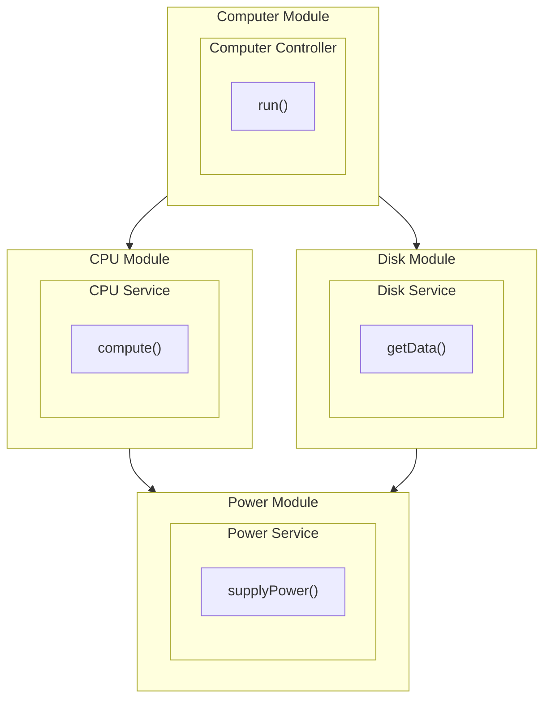

## Description

[Nest](https://github.com/nestjs/nest) framework TypeScript starter repository.

```bash
nest new di
```

## Installation

```bash
$ npm install
```

## Running the app

```bash
# development
$ npm run start

# watch mode
$ npm run start:dev

# production mode
$ npm run start:prod
```

## Test

```bash
# unit tests
$ npm run test

# e2e tests
$ npm run test:e2e

# test coverage
$ npm run test:cov
```

## Commands used

- First, generate the **modules**:

  ```bash
  nest generate module computer
  nest generate module cpu
  nest generate module disk
  nest generate module power
  ```

- Then, generate the **services**:

  ```bash
  nest generate service cpu
  nest generate service power
  nest generate service disk
  ```

- Finally, generate the **controller**:

  ```bash
  nest generate controller computer
  ```

## App diagram


